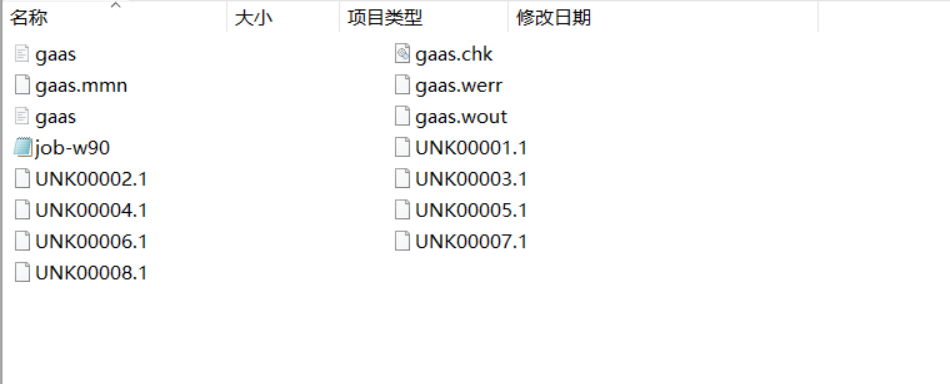

最近在慢慢接触第一性计算的相关内容,需要补充一些工具,这里就整理记录一下我在学习Wannier90过程中遇到的疑问和自己对其中内容的一些理解.
{:.info}
<!--more-->
我在这里完全就先是重复Wannier90给出的例子,在重复的过程中通过文档边学习边理解.
# Gallium Arsenide(Example 1)
最主要的就是输入控制文件**file.win**,这个文件来控制要进行什么样的计算.这里需要说明,要计算不同的性质和物理量,除了控制文件之外还需要其他的数据,这第一个实例中的文件如下



```shell
! Gallium Arsenide: Tutorial Example 1

 num_wann    =  4
 num_iter    = 20


 wannier_plot = true
! SYSTEM

begin unit_cell_cart
bohr
-5.367  0.000  5.367
 0.000  5.367  5.367
-5.367  5.367  0.000
end unit_cell_cart

begin atoms_frac
Ga 0.00   0.00   0.00
As 0.25  0.25  0.25
end atoms_frac

begin projections
As:sp3
end projections

! KPOINTS

mp_grid : 2 2 2

begin kpoints
0.0 0.0 0.0
0.0 0.0 0.5
0.0 0.5 0.0
0.0 0.5 0.5
0.5 0.0 0.0
0.5 0.0 0.5
0.5 0.5 0.0
0.5 0.5 0.5
end kpoints

!We set this flag to read the bloch states from
!a formatted file. This is to ensure the example
!works on all platforms. The default (.false.) state
!should be used on production runs
wvfn_formatted=.true.
```
下面对控制文件中的一些参数进行解释
**num_wann:**控制需要寻找的Wannier函数的数目.

**num_bands:**这个参数和`file.mmn`中的信息相关,表示生成这个文件中能带的数目是多少,就像我在[Bi$_2$Se$_3$](https://yxli8023.github.io/2021/04/18/VASP-Bi2Se3.html)这个实例中,我可以从vasp的计算中得到计算的能带数目是64.

**num_iter:**在求解最大局域化Wannier函数的过程中的迭代次数控制,默认值是100.

**wannier_plot:**用来控制是否计算出费米面相关的信息,最后会产生`file.xsf`的文件,不过需要用特定的软件来绘图.

```shell
begin unit_cell_cart
bohr
-5.367  0.000  5.367
 0.000  5.367  5.367
-5.367  5.367  0.000
end unit_cell_cart
```
这个控制参数用来声明计算体系元胞的信息,`unit_cell_cart`表示是用直角坐标,这里的`bohr`表示坐标的单位,也可以设置为`Ang`,一般默认值是`Ang`.

```shell
begin atoms_frac
Ga 0.00   0.00   0.00
As 0.25  0.25  0.25
end atoms_frac
```
元胞设置好之后,就需要明确元胞中原子的位置,`atoms_frac`表明用的是分数坐标来表示原子位置;同样也可以使用`atoms_cart`,此时就是利用直角坐标表示位置.

```shell
begin projections
As:sp3
end projections
```
每个原子上的投影轨道设置(暂时不太懂,等之后把理论好好研究一番再回来).

```shell
mp_grid : 2 2 2
```
Monkhorst-Pack网格上的撒点密度.

```shell
begin kpoints
0.0 0.0 0.0
0.0 0.0 0.5
0.0 0.5 0.0
0.0 0.5 0.5
0.5 0.0 0.0
0.5 0.0 0.5
0.5 0.5 0.0
0.5 0.5 0.5
end kpoints
```
这个参数在利用vasp结合Wannier90计算的时候,刚开始不会设置,在运行结束之后会自动产生,暂时不明白这个参数的具体含义.

# Lead(Example 2)
这个实例中计算文件如下所示


这里的`lead.eig`中包含的是每个k点处的Block本征值,是为了在这个实例中进行费米面的插值计算准备的.控制输入文件`lead.win`内容如下
```shell
! Lead : Tutorial Example 2

 num_wann        =   4
 num_iter        = 20

! SYSTEM

begin unit_cell_cart
bohr
-4.67775 0.00000 4.67775
 0.00000 4.67775 4.67775
-4.67775 4.67775 0.00000

end unit_cell_cart

begin atoms_frac
Pb 0.00   0.00   0.00
end atoms_frac

begin projections
Pb:sp3
end projections

! KPOINTS

mp_grid : 4 4 4

begin kpoints
0.0000  0.0000   0.0000
0.0000  0.2500   0.0000
0.0000  0.5000   0.0000
0.0000  0.7500   0.0000
0.2500  0.0000   0.0000
0.2500  0.2500   0.0000
0.2500  0.5000   0.0000
0.2500  0.7500   0.0000
0.5000  0.0000   0.0000
0.5000  0.2500   0.0000
0.5000  0.5000   0.0000
0.5000  0.7500   0.0000
0.7500  0.0000   0.0000
0.7500  0.2500   0.0000
0.7500  0.5000   0.0000
0.7500  0.7500   0.0000
0.0000  0.0000   0.2500
0.0000  0.2500   0.2500
0.0000  0.5000   0.2500
0.0000  0.7500   0.2500
0.2500  0.0000   0.2500
0.2500  0.2500   0.2500
0.2500  0.5000   0.2500
0.2500  0.7500   0.2500
0.5000  0.0000   0.2500
0.5000  0.2500   0.2500
0.5000  0.5000   0.2500
0.5000  0.7500   0.2500
0.7500  0.0000   0.2500
0.7500  0.2500   0.2500
0.7500  0.5000   0.2500
0.7500  0.7500   0.2500
0.0000  0.0000   0.5000
0.0000  0.2500   0.5000
0.0000  0.5000   0.5000
0.0000  0.7500   0.5000
0.2500  0.0000   0.5000
0.2500  0.2500   0.5000
0.2500  0.5000   0.5000
0.2500  0.7500   0.5000
0.5000  0.0000   0.5000
0.5000  0.2500   0.5000
0.5000  0.5000   0.5000
0.5000  0.7500   0.5000
0.7500  0.0000   0.5000
0.7500  0.2500   0.5000
0.7500  0.5000   0.5000
0.7500  0.7500   0.5000
0.0000  0.0000   0.7500
0.0000  0.2500   0.7500
0.0000  0.5000   0.7500
0.0000  0.7500   0.7500
0.2500  0.0000   0.7500
0.2500  0.2500   0.7500
0.2500  0.5000   0.7500
0.2500  0.7500   0.7500
0.5000  0.0000   0.7500
0.5000  0.2500   0.7500
0.5000  0.5000   0.7500
0.5000  0.7500   0.7500
0.7500  0.0000   0.7500
0.7500  0.2500   0.7500
0.7500  0.5000   0.7500
0.7500  0.7500   0.7500
end kpoints
```
这里的参数没有过多解释的必要,在前面的实例中都出现过了.在这个控制文件中加入
```shell
 restart = plot
 fermi_energy = 5.2676
 fermi_surface_plot = true
```
之后,重新进行计算,可以得到


所示的文件,这里的`lead.bxsf`就是插值得到的费米面的信息,只需上面的参数,从名字可就可以理解了.


