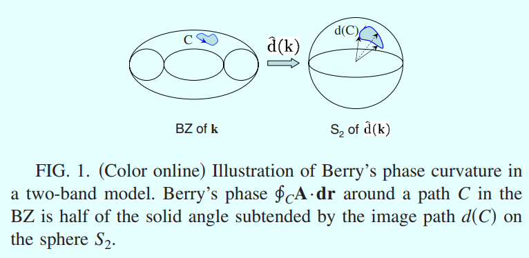
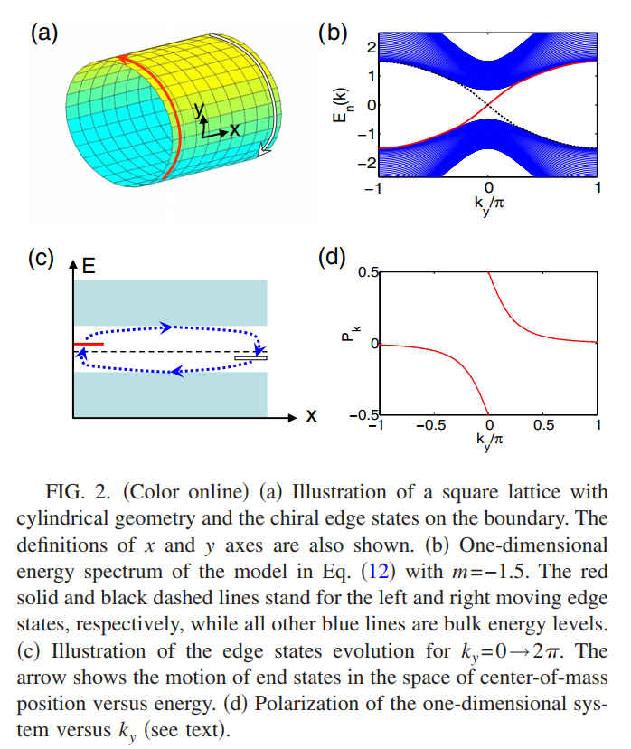
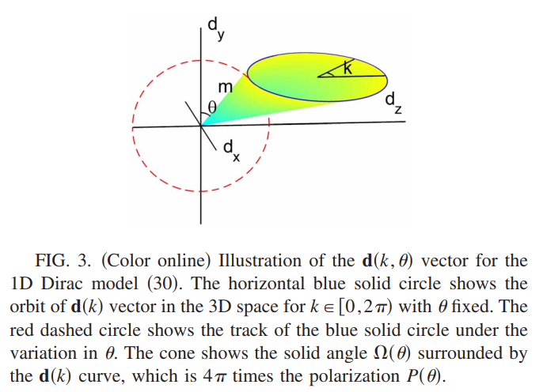
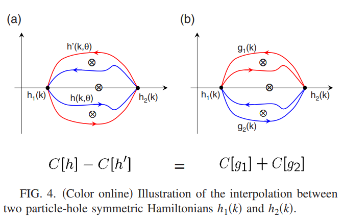
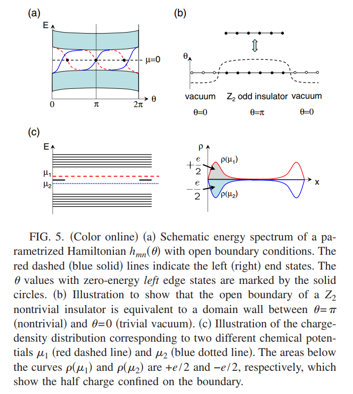
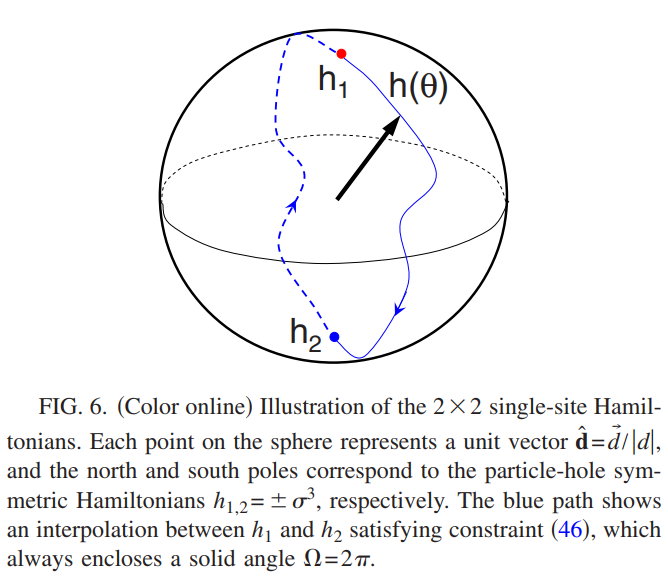
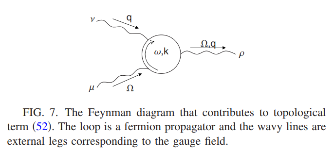
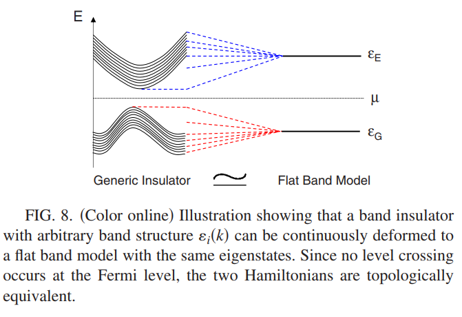

这篇博客中,整理自己在学习拓扑绝缘体相关的拓扑场论过程中的一些概念整理和自己的笔记.
{:.info}
<!--more-->

第一Chern数:对Berry 位相规范场的曲率在整个BZ中的积分.

在1D时,在绝热演化的泵浦循环周期中,电子极化或者净电荷泵浦数目正好对应于Berry位相在动量及参数混合空间中的积分,和Chern数也存在一定的关联(2D).这个积分得到的整数正是量子化的拓扑数.

拓扑磁电效应(TME):外加一个电场,会在相同的方向上诱导出磁场,其比值是个普适的常数,一个奇数乘以乘以精细结构常数$\alpha=e^2/(\hbar c)$.

# 第一Chern数及(2+1)维拓扑响应函数

一个(2+1)维的紧束缚哈密顿量为

$$H=\sum_{m,n;\alpha,\beta}c^\dagger_{m\alpha}h^{\alpha\beta}_{mn}c_{n\beta}$$

在实空间中,矩阵的维度大小及对应着能带数目,$\alpha,\beta=1,2,\cdots,N$.当系统具有平移对称性的时候$h^{\alpha\beta}_{mn}=h^{\alpha\beta}(\vec{r}_m-\vec{r}_n)$哈密顿量可以在Bloch基矢下写成对角形式

$$H=\sum_{\bf k}c^\dagger_{\mathbf{k}\alpha}h^{\alpha\beta}({\bf k})c_{\mathbf{k}\beta}$$

当存在外部电磁场耦合时$h^{\alpha\beta}_{mn}\rightarrow h^{\alpha\beta}_{mn}e^{iA_{mn}}$,这里$A_{mn}$是订立在离散格点上的规范势.在线性阶近似下,耦合电磁场的哈密顿量为

$$H\simeq\sum_{\bf k}c^\dagger_{\bf k}h({\bf k})c_{\bf k}+\sum_{\bf k,q}A^i(-{\bf q})c^\dagger_{\bf k+q/2}\frac{\partial h({\bf k})}{\partial k_i}c_{\bf k-q/2}$$

系统对外场$A^i({\bf q})$的直流响应可以通过标准的Kubo公式得到

$$\sigma_{ij}=\text{lim}_{\omega\rightarrow 0}\frac{i}{\omega}Q_{ij}(\omega+i\delta),\quad Q_{ij}(i\nu_m)=\frac{1}{\Omega\beta}\sum_{\mathbf{k},n}\text{Tr}\{J_i({\bf k})G[\mathbf{k},i(\omega_n+\nu_m)]\cdot J_j(\mathbf{k})G(\mathbf{k},i\omega_n)\}\label{h4}$$

对于直流电$J_i({\bf k})=\frac{\partial h({\bf k})}{\partial k_i},i,j=x,y$,格林函数$G(\mathbf{k},i\omega_n)=[i\omega_n-h({\bf k})]^{-1}$,$\Omega$表示系统的表面积.当系统是个绝缘体的时候,$M$个占据态,c此时系统的纵向电导为零$\sigma_{xx}=0$,而横向电导为

$$\sigma_{xy}=\frac{e^2}{h}\frac{1}{2\pi}\int dk_x\int dk_yf_{xy}({\bf k}),\quad f_{xy}({\bf k})=\frac{\partial a_y({\bf k})}{\partial k_x}-\frac{\partial a_x({\bf k})}{\partial k_y},\\ a_i({\bf k})=-i\sum_{\alpha\in\text{occ}}\langle\alpha\mathbf{k}\rvert\frac{\partial}{\partial k_i}\rvert\alpha\mathbf{k}\rangle,\quad i=x,y$$$$

物理上$a_i({\bf k})$是动量空间中Berry位相规范场的$U(1)$分量.量子化的第一Chern数为

$$C_1=\frac{1}{2\pi}\int k_x\int k_y f_{xy}({\bf k})\in\mathbb{Z}$$

对于任意定义在BZ上的连续态$\rvert\alpha\mathbf{k}\rangle$都是满足的.由于电荷守恒,Hall效应响应为$j_i=\sigma_H\epsilon^{ij}E_j$同样会诱导出另外一个响应方程

$$j_i=\sigma_H\epsilon^{ij}E_j\rightarrow\frac{\partial\rho}{\partial t}=-\nabla\cdot{\bf j}=-\sigma_H\nabla\times \mathbf{E}=\sigma_H\frac{\partial B}{\partial t},\rightarrow\rho(B)-\rho_0=\sigma_HB\label{h1} $$

这里$\rho_0=\rho(B=0)$是基态的电荷密度.将(\ref{h1})结合磁轭城一个协变形式为

$$j^\mu=\frac{C_1}{2\pi}\epsilon^{\mu\nu\tau}\partial_\nu A_\tau\label{h2}$$

这里$\mu,\nu,\tau=0,1,2$分别是时间和空间索引.此时选择自然单位制$e=\hbar=1,e^2/h=1/2\pi$.

响应(\ref{h2})可以有外场$A_\mu$的Chern-Simons拓扑场论描述

$$S_\text{eff}=\frac{C_1}{4\pi}\int d^2x\int dt A_\mu\epsilon^{\mu\nu\tau}A_\tau$$

由$\delta S_\text{eff}/\delta A_\mu=j^\mu$既可以得到响应电流(\ref{h2}).这样的有效作用量是拓扑不变的,和第一Chern数的性质相同,所有量子霍尔态的拓扑响应都可以通过Chern-Simons理论来描述.

## Example:Two band models

考虑一个实际的两带模型

$$h({\bf k})=\sum_{a=1}^3[d_a({\bf k})\sigma_a+\epsilon({\bf k})\mathbb{1}]$$

这里$\mathbb{1}$是$2\times 2$的单位矩阵,$\sigma_a$是Pauli矩阵,这里$\sigma_a$可以表示自旋或者轨道,如果是真自旋则$\sigma_a$在时间反演操作下是增加一个负号的,如果$d_a({\bf k})$是奇函数,那么哈密顿量是满足时间反演不变的.如果任何一个$d_a$包含常数项,那么这个模型是破坏时间反演的.如果$\sigma_a$表示赝自旋(轨道),此时$\mathcal{T}^2=1$,只有$\sigma_y$在时间反演操作下出现一个负号,$\sigma_x,\sigma_z$都是不变的.单位矩阵在时间反演操作下是不变的,所以$\epsilon({\bf k})$在时间反演操作下是偶函数.上面哈密顿量对应的能谱为$E({\bf k})=\epsilon({\bf k})\pm\sqrt{\sum_ad^2_a({\bf k})}$.

在单粒子哈密顿量$h({\bf k})$中,矢量${\bf d(k)}$就像是作用在两能级赝自旋$\sigma_i$上的Zeeman场,占据态能带满足$[{\bf d(k)\cdot\sigma}]\rvert -,\mathbf{k}\rangle=-\rvert{\bf d(k)}\rvert\rvert-,\mathbf{k}\rangle$,这表明spinor的自旋极化方向为${\bf -d(k)}$,因此在$\rvert-,\mathbf{k}\rangle$上沿着某个${\bf k}$空间的路径$C$进行绝热演化时获得的Berry位相等于自旋$1/2$的粒子在磁场中沿着$\mathbf{d}(C)$绝热旋转时获得的Berry位相,**着正就是由路径$\mathbf{d}(C)$所张开的立体角的一半.**因此第一Chern数$C_1$可以被${\bf d(k)}$围绕原点的winding来确定

$$C_1=\frac{1}{2\pi}\int dk_x\int dk_y\hat{\bf d}\cdot\frac{\partial\hat{\bf d}}{\partial k_x}\times\frac{\partial\hat{\bf d}}{\partial k_y}$$

一个实际的物理模型为

$h({\bf k})=\sin k_x\sigma_x+\sin k_y\sigma_y+(m+\cos k_x+\cos k_y)\sigma_z$

这里$\epsilon({\bf k})=0,{\bf d(k)}=(\sin k_x,\sin k_y,m+\cos k_x+\cos k_y)$,体系的Chern数为

$$C_1=\left\{\begin{array}{c}1\qquad\text{for $0<m<2$}\\-1\qquad\text{for $-2<m<0$}\\0\qquad\text{otherwise}\end{array}\right.$$

在$m\rightarrow 2$的连续极限下,模型可以约化为(2+1)-D的有质量Dirac哈密顿量

${\bf h(k)}=k_x\sigma_x+k_y\sigma_y+(m+2)\sigma_z=\left(\begin{array}{cc}m+2&k_x-ik_y\\ k_x+ik_y&-m-2\end{array}\right)$

在实空间中的紧束缚形式为

$$H=\sum_n[c^\dagger_n\frac{\sigma_z-i\sigma_x}{2}c_{n+\hat{x}}+c^\dagger_n\frac{\sigma_z-i\sigma_y}{2}c_{n+\hat{y}}+\text{H.c}]+m\sum_nc^\dagger_n\sigma_zc_n\label{h3}$$

这个模型可以描述量子反常霍尔效应,体系统是存在自旋轨道耦合($\sigma_x,\sigma_y$)以及铁磁极化$\sigma_z$.

## 维度约化

为了研究第一Chern数和拓扑响应之间的联系,可以通过维度约化来进行,首先在一个圆柱结构上研究量子霍尔态.一个非平庸的量子霍尔系统会存在手性边界态,对于最简单的Chern数$C_1=1$的情况,系统每个边界上都会存在一支手性费米子.可以将哈密顿量(\ref{h3})放在一个圆柱体结构上进行计算(一个方向是周期边界,另外一个方向是开边界).此时周期边界方向的的$k$是一个好量子数,进行一个部分Fourier变换

$c_{k_ya}(x)=\frac{1}{\sqrt{L_y}}\sum_yc_\alpha(x,y)e^{ik_yy}$

这里的$(x,y)$表示正方点整上的坐标,最后可以将哈密顿量(\ref{h3})改写为

$H=\sum_{k_y,x}[c^\dagger_{k_y}(x)\frac{\sigma_z-i\sigma_x}{2}c_{k_y}(x+1)+\text{H.c}]+\sum_{k_y,x}c^\dagger_{k_y}(x)[\sin k_y\sigma_y+(m+\cos k_y)\sigma_z]c_{k_y}(x)\equiv\sum_{k_y}H_\text{1D}(k_y)$

在经过这个变换之后就可以将原本的2D系统看做是一个$L_y$依赖的1D紧束缚模型链,$L_y$表示在$y$方向上的周期晶格数目.而哈密顿量$H_\text{1D}$的本征值可以在每个$k_y$下通过数值方式求解,如下图所示

可以发现此时有个很明显的边界态会穿过体能隙,并且分别位于$x=0,L_x$这两个边界上.而且每条边界态的手性(费米速度)也是不同的,从图中也可以看出费米速度$v=\partial E/\partial k$对于左边界态总是正的,而对于右边界态总是负的,霍尔效应可以通过Laughlin的规范讨论来进行理解.考虑一个沿着$y$方向的电场$E_y$,可以表示为

$A_y=-E_yt,\quad A_x=0$

将哈密顿量改写为$H=\sum_kH_\text{1D}(k_y+A_y)$,沿着$x$方向的电流为

$J_x=\sum_{k_y}J_x(k_y)$

$J_x(k_y)$是一维系统的电流,此时2D系统的Hall响应可以通过参数化的1D系统$H_\text{1D}$决定,含时变化为$q(t)-k_y+A_y(t)$.规范势$A_y$对应着一个通量$\Phi=A_yL_y$穿过整个圆柱体结构,在一个周期变化中$0\leq t\leq2\pi/L_yE_y$通量从$0$变化到$2\pi$,而这个过程中流过系统的电荷为

$\Delta Q=\int_0^{\Delta t}dt\sum_{k_y}J_x(k_y)\equiv\sum_{k_y}\Delta P_x(k_y)\rvert_0^{\Delta t}$

一个周期中$\Delta t=2\pi/L_yE_y$,在第二个恒等式中利用了1D系统中电荷极化与电流的关系$T_x(k_y)=dP_x(k_y)/dt$,在热力学极限下系统总是处在$H_{1D}[q(t)]$的基态中,因此极化的改变$\Delta P_x(k_y)=P_x(k_y-2\pi/L_y)-P_x(k_y)$.当$L_y\rightarrow\infty$时,$\Delta Q$表示为

$$\Delta Q=-\int_0^{2\pi}dk_y\frac{\partial p_x(k_y)}{\partial k_y}$$

穿过圆柱体结构的通量变化导致的Hall效应所产生的的电荷流动等于在一维系统$H_{1D}(k_y)$当$k_y$从0变化到$2\pi$时的电荷流动.从Hall响应可以得到$\Delta Q=\sigma_H\Delta tE_yL_y=2\pi\sigma_H$是个量子化的整数,可以从1D的图像上进行理解.当$k_y$在0到$2\pi$进行变化的时候,边界态的能量和位置将会发生变化,如上图所示.**由于在左(右)边界态的能量总是增加(减少)随着$k_y$的变化,在一个半填充的系统中电荷总会被泵浦到左边界,这将会使得$\Delta Q=-1$**.这个量子化的值可以通过计算极化$P_x(k_y)$来得到,如上图(d)所示,当$P_x$在一边发生一个跃变的时候,就会有$\Delta Q=-1$.

上面维度约化的研究可以适用于任何一个2D的绝缘体系统,对于一般的2D系统可以定义其对应的1D系统为

$$H_{1D}(\theta)=\sum_{k_x}c^\dagger_{k_x,\theta}h(k_x,\theta)c_{k_x,\theta}$$

此时用$\theta$代替了有方向的动量$k_y$,并且替代了$q(t)$,当$\theta$是含时的,可以通过Kubo公式(\ref{h4})来计算电流响应,只不过此时对$(k_x,k_y)$的求和变成了只对$k_x$进行求和.线性响应可以定义为

$$J_x(\theta)=G(\theta)\frac{d\theta}{dt},\quad G(\theta)=\text{lim}_{\omega\rightarrow 0}\frac{i}{\omega}Q(\omega+i\delta;\theta)\\ Q(i\omega_n;\theta)=-\sum_{k_x,i\nu_m}\text{Tr}\{J_x(k_x;\theta)G_{1D}[k_x,i(\nu_m+\omega_n);\theta]\times\frac{\partial h(k_x;\theta)}{\partial \theta}G_{1D}(k_x,i\omega_n;\theta\}\frac{1}{L_x\beta}\label{h5}$$

响应系数格局Berry位相规范场表示为

$$G(\theta)=-\int\frac{dk_x}{2\pi}f_{x\theta}(k_x,\theta)=\int\frac{dk_x}{2\pi}(\frac{\partial a_x}{\partial \theta}-\frac{\partial a_\theta}{\partial k_x}),\quad \int G(\theta)d\theta=C_1\in\mathbb{Z}$$

如果选择一个合适的规范,使得$a_\theta$总是单只的,则$G(\theta)$可以进一步简化

$G(\theta)=\frac{\partial}{\partial \theta}(\int\frac{dk_x}{2\pi}a_x(k_x,\theta))\equiv\frac{\partial P(\theta)}{\partial \theta},\quad P(\theta)=\int dk_xa_x/2\pi$

这正是1D系统对应的电荷极化,响应函数变为$J_x=\partial P/\partial t$.**因为电子极化P的定义是电子的质心位置偏移格点的大小,所以它的定义只有mod 1才是well defined**.因此一个周期演化的变化量$\Delta P=P(\theta=2\pi)-P(\theta=0)$是个整数,等于$-C_1$,也正好对应着整个系统的电荷泵浦数目.
{:.success}

和量子Hall情况相似,电流响应将会导致电荷密度的响应,着可以通过电荷守恒条件来确定,当参数$\theta$同时具有时间和空间变化时$\theta(x,t)$,响应方程(\ref{h5})仍然适用,从连续性方程可得到

$$\frac{\partial\rho}{\partial t}=-\frac{\partial J_x}{\partial x}=-\frac{\partial^2P(\theta)}{\partial x\partial t}\rightarrow\rho=-\frac{\partial P(\theta)}{\partial x}\label{ha8}$$

这里电荷密度$\rho$是基于背景电荷而言.此时密度与电流响应可以写为

$$j_\mu=-\epsilon_{\mu\nu}\frac{\partial[\theta(x,t)]}{\partial x_\nu},\quad\mu,\nu=0,1\text{分别是时间和空间}$$

一般情况下当哈密顿量随着时间和空间是平缓变时,单粒子哈密顿量$h(k)$变为$h(k,x,t)=h[k,\theta(x,t)]$,其对应的本征态为$\rvert\alpha;k,x,t\rangle$,这里的$\alpha$是能带索引.定义在相空间中的Berry位相规范场

$\mathcal{A}_A=-i\sum_\alpha\langle\alpha;q_A\rvert\frac{\partial}{\partial q_A}\rvert\alpha;q_A\rangle,\quad\mathcal{F}_{AB}=\partial_A\mathcal{A}_B-\partial_B\mathcal{A}_A$

相空间流为

$$j^p_A=-\frac{1}{4\pi}\epsilon_{ABC}\mathcal{F}_{BC}$$

实际的物理流可以通过对波矢流型进行积分得到

$j_\mu=\int dkj^P_\mu=-\int\frac{dk}{2\pi}\epsilon^{\mu2\nu}\mathcal{F}_{2\nu},\quad\mu,\nu=0,1$

对于一个SSH模型

$$h(k,\theta)=\sin k\sigma_x+(\cos k-1)\sigma_z+m(\sin\theta\sigma_y+\cos\theta\sigma_z),\quad m>0$$

在$m<<1$的极限下,将哈密顿量展开成连续模型$h(k,\theta)\simeq k\sigma_x+m(\sin\theta\sigma_y+\cos\theta\sigma_z)$,着是一个连续的(1+1)D Dirac模型,有一个实质量$m\cos\theta$和一个虚质量$m\sin\theta$,根据前面的讨论,此时极化$\int dk_xa_x/2$可以由矢量$\mathbf{d}(k)=(\sin k,m\sin\theta,m\cos\theta+\cos k-1)$所张开的立体角来决定,如下图所示

在$m<<1$的即现在,可以发现张开的立体角$\Omega(\theta)=2\pi$,因此极化$P(\theta)\simeq\theta/2\pi$,响应电流为

$$j_\mu=-\epsilon_{\mu\nu}\partial_\nu\theta$$

在$\theta$场的畴壁上电荷积累为$Q=\int_{-\infty}^{+\infty}(d\theta/dx)(dx/2\pi)=-[\theta(+\infty)-\theta(-\infty)]/2\pi$.对于反位相的畴壁$\theta(+\infty)-\theta(-\infty)=\pi$,从而可以得到此时的存在分数电荷$q=\frac{1}{2}$.

## (1+1)维$\mathbb{Z}_2$分类粒子空穴对称绝缘体
对于一个一维的紧束缚哈密顿量$H=\sum_{mn}c^\dagger_{m\alpha}h^{\alpha\beta}_{mn}c_{n\beta}$粒子空穴变换定义为$c_{m\alpha}\rightarrow C^{\alpha\beta}c^\dagger_{m\beta}$,这里电荷共轭矩阵$C$满足$C^\dagger C=\mathbb{I},C^*C=\mathbb{I}$.在周期性边界条件下对称性要求

$$H=\sum_kc^\dagger_kh(k)c_k=\sum_kc_{-k}C^\dagger h(k)Cc^\dagger_{-k}\rightarrow C^\dagger h(-k)C=-h^T(k)$$

从上式可以知道,如果$E$是$h(0)$的本征值,那么$-E$也是,即哈密顿量的能谱是正负对称的.如果$h(k)$的维度是奇数,那么至少存在一个零能本征值$E=0$.此时因为$h$是traceless 的,因此化学势为零,这个系统不能被打开能隙,除非$h$的维度是偶数.

现在考虑两个满足粒子空穴对称的绝缘体哈密顿量$h_1(k),h_2(k)$.通常可以在两者之间插入一个连续的$h(k,\theta)$其定义为

$$h(k,0)=h_1(k),\quad h(k,\pi)=h_2(k)$$

而且总是可以找到一个合适的参数使得$\theta\in[0,\pi]$区间内$h(k,\theta)$总是有能隙的.总而言之,拓扑空间中所有1D拓扑绝缘体$h(k,\theta)$都是相互联系的,这也是**Neumann–Wigner theorem  **保证的.

假设$h(k,\theta)$是在$h_1(k),h_2(k)$之间一个有能隙的,通常在$\theta\in[0,\pi],h(k,\theta)$不必要满足粒子空穴对称,对$\theta\in[\pi,2\pi]$定义

$$h(k,\theta)=-[C^{-1}h(-k,2\pi-\theta)C]^T\label{ha6}$$

选择这个参数化视为了当$\theta$被替换为高位空间中的动量波矢的时,哈密顿量满足粒子空穴对称.由于$h(k,\theta=0)$与$h(k,\theta=\pi)$的例子空穴对称,在$\theta\in[0,2\pi]$区间内$h(k,\theta)$是连续的,且$h(k,2\pi)=h(k,0)$.当$\theta$从0到$2\pi$进行绝热演化并对$h(k,\theta)$定义一个周期绝热泵浦,此时第一Chern数是定义在$(k,\theta)$空间中的,Chern数$C[h(k,\theta)]$可以表示成极化的winding number

$$C[h(k,\theta)]=\int d\theta\frac{\partial p(\theta)}{\partial\theta},\quad p(\theta)=\int\frac{dk}{2\pi}\sum_{E_\alpha(k)<0}(-i)\langle k,\theta;\alpha\rvert\partial_k\rvert k,\theta;\alpha\rangle$$

这里求和是对所有的占据态进行的.通常情况下两个不同的参数化$h(k,\theta),h^{'}(k,\theta)$会对应着不同的Chern数$C[h(k,\theta)]\neq C[h^{'}(k,\theta)]$,然而由对称限制(\ref{ha6})保证这两个不同的Chern数相差偶数$C[h(k,\theta)]-C[h^{'}(k,\theta)]=2n,n\in\mathbb{Z}$.

接下来证明上面的结论,对$h(k,\theta)$的本征态$\rvert k,\theta;\alpha\rangle$对应的本征值$E_\alpha(k,\theta)$,利用(\ref{ha6})可得

$$h(-k,2\pi-\theta)C\rvert k,\theta;\alpha\rangle^*=-E_\alpha(k)C\rvert k,\theta;\alpha\rangle^*$$

$\rvert k,\theta;\alpha\rangle^*=\sum_\beta(\langle m,\beta\rvert k,\theta;\alpha\rangle^*)\rvert m,\beta\rangle,$这里$m,\beta$分别是未知空间格点和轨道索引.因此$C\rvert k,\theta;\alpha\rangle^*\equiv\rvert -k,2\pi-\theta;\bar{\alpha}\rangle$是$h(-k,2\pi-\theta)$的本征态,对应的本征值为$E_{\bar{\alpha}}(k,2\pi-\theta)=-E_\alpha(k,\theta)$.哈密顿量$h(k,\theta)$与$h(-k,2\pi-\theta)$的本征态是一一对应的,从而可以得到

$$P(\theta)=\int\frac{dk}{2\pi}\sum_{E_\alpha(k)<0}(-i)\langle k,\theta;\alpha\rvert\partial_k\rvert k,\theta;\alpha\rangle=\int\frac{dk}{2\pi}\sum_{E_{\bar{\alpha}(-k)}>0}(-i)(\langle -k,2\pi-\theta;\bar{\alpha}\rvert)^*\cdot\partial_k\rvert -k,2\pi-\theta;\bar{\alpha}\rangle^*=-P(2\pi-\theta)\label{ha7}$$

因此$P(\theta)\quad\text{mod}\quad1$是well defined,(\ref{ha7})表明$P(\theta)+P(2\pi-\theta)=0\quad\text{mod}\quad 1$.对于$\theta=0$或者$\theta=\pi$有$2\pi-\theta=0\quad\text{mod}\quad 2\pi$,从而得到$P(\theta)=0\quad or\quad1/2$.也就是说极化取值为$1$或者$1/2$对任何满足粒子空穴对称的绝缘体.**如果两个系统具有不同的极化P,在不破坏粒子空穴对称情况下,是不能通过绝热演化相互转换的,因为在绝热演化过程中P是个连续函数,当它不是0或者1/2时就破坏了粒子空穴对称.**这也就解释了为什么在存在粒子空穴对称的情况下系统是$\mathbb{Z}_2$分类的.有前面的定义可知极化$P(\theta)=\int dk a_k/2\pi$是规范依赖的,下面就来定义一个更加普遍的$\mathbb{Z}_2$表达式,它仅包含规范不变量$\partial P(\theta)/\partial\theta$和Chern数$C_1$.

由对称性(\ref{ha7})可得

$$\int_0^\pi dP(\theta)=\int_\pi^{2\pi}dP(\theta)\label{ha8}$$

它是规范独立的,因为只包含了极化$P(\theta)$的变化.这个方程表明在闭合路径的前半部分与后半部分极化的变化都是相同的.考虑两个不同的参数化过程$h(k,\theta),h^{'}(k,\theta)$满足$h(k,0)=h^{'}(k,0)=h_1(k),h(k,\pi)=h^{'}(k,\pi)=h_2(k)$.这里$h(k,\theta),h^{'}(k,\theta)$对应的极化分别为$P(\theta),P^{'}(\theta)$,二者对应的Chern数之差为

$$C[h]-C[h^{'}]=\int_0^{2\pi}d\theta(\frac{\partial P(\theta)}{\partial\theta}-\frac{\partial P^{'}(\theta)}{\partial\theta})$$

定义新的差值$g_1(k,\theta),g_2(k,\theta)$

$$g_1(k,\theta)=\left\{\begin{array}{c}h(k,\theta),\quad\theta\in[0,\pi]\\h^{'}(k,2\pi-\theta),\quad\theta\in[\pi,2\pi]\end{array}\right.\\g_2(k,\theta)=\left\{\begin{array}{c}h^{'}(k,2\pi-\theta),\quad\theta\in[0,\pi]\\h(k,\theta),\quad\theta\in[\pi,2\pi]\end{array}\right.$$

这里$g_1(k,\theta)$与$g_2(k,\theta)$只是重新组合对两个路劲$h(k,\theta),h^{'}(k,\theta)$进行了组合,如下图所示

从$g_1,g_2$的构建路径可以直接得到

$C[g_1]=\int_0^\pi d\theta(\frac{\partial P(\theta)}{\partial \theta}-\frac{\partial P^{'}(\theta)}{\partial\theta})\\ C[g_2]=\int^{2\pi}_\pi d\theta(\frac{\partial P(\theta)}{\partial\theta}-\frac{\partial P^{'}(\theta)}{\partial\theta})$

因此可以得到$C[h]-C[h^{'}]=C[g_1]+C[g_2]$,由(\ref{ha8})可以得到$C[g_1]=C[g_2]$,从而$C[h]-C[h^{'}]=2C[g_1]$.由于$C[g_1]\in\mathbb{Z}$我们可以得到$C[h]-C[h^{'}]$的取值是偶数.Chern数$C[h],C[h^{'}]$的不同是因为它们对应的路径之间存在奇异点,而且由于粒子空穴对称性的存在,这个奇异点的位置也是对称的.基于上面的讨论,可以定义一个相对Chern宇称

$$N_1[h_1(k),h_2(k)]=(-1)^{C[h(k,\theta)]}$$

它与$h(k,\theta)$的选取无关,只决定于哈密顿量$h_1(k),h_2(k)$.而且对于任意三个粒子空穴对称的哈密顿量$h_1(k),h_2(k),h_3(k)$总是满足

$N_1[h_1(k),h_2(k)]N_1[h_2(k),h_3(k)]=N_1[h_1(k),h_3(k)]$

由$N_1[h_1(k),h_2(k)]=1$在任意两个粒子空穴对称哈密顿量之间定义了一个等价关系,因此可以将所有满足粒子空穴对称的哈密顿量分成两类.定义一个真空态$h_0(k)\equiv h_0$,这里$h_0$是任意一个不依赖于动量$k$的矩阵且满足粒子空穴对称$C^\dagger h_0C=-h_0^T$,可以认为$h_0$描述的是一个没有hopping完全局域的系统,将它作为一个平庸的参考态可以得到$N_1[h_0(k),h_1(k)]\equiv N_1[h(k)]$作为哈密顿量$h(k)$的$\mathbb{Z}_2$拓扑不变量.所有满足$N_1[h_0(k),h(k)]=1$的哈密顿量$h(k)$都是$\mathbb{Z}_2$平庸的,满足$N_1[h_0(k),h(k)]=-1$的都是$\mathbb{Z}_2$非平庸的.

对于一个$\mathbb{Z}_2$非平庸的哈密顿量$h_1(k)$可以定义一个差值$h(k,\theta)$满足$h(k,0)=h_0,h(k,\pi)=h_1(k)$,对应的Chern数为$C[h(k,\theta)]$为奇整数,如果研究一个一维开边界的系统$h(k,\theta)$,实空间中的紧束缚哈密顿量为

$$h_{mn}(\theta)=\frac{1}{\sqrt{L}}\sum_ke^{ik(x_m-x_n)}h(k,\theta),\quad 1\leq m,n\leq L$$

此时再$h(k,\theta)$的能隙中有一个束缚态,与非零的Chern数相关联.当Chern数$C[h(k,\theta)]=2n-1,n\in\mathbb{Z}$这里由一些值$\theta^L_s\in[0,2\pi),s=1,2,\cdots,2n-1$,此时哈密顿量$h_{mn}(\theta_s)$有零能的局域态在系统的左边界上,同样的有相同数目的零能态在有边界上其$\theta^R_s$与左端相同.

由于再$h_{mn}(\theta)$与$h_{mn}(2\pi-\theta)$之间有粒子空穴对称性的存在,零能态总是成对出现在$\theta$与$2\pi-\theta$处.当Chern数是奇数是,一定有零能级出现在$\theta=0$和$\theta=\pi$.由于$\theta=0$是个平庸的绝缘体,对应着平带因此不存在终端态,局域的零能拓扑态出现在$\theta=\pi$处.总而言之,一个粒子空穴对称的$\mathbb{Z}_2$拓扑绝缘体在开边界的时候会存在一个零能的局域态.存在零能级会有一个重要的物理结果，在非平庸拓扑绝缘体边界上将会存在半整数的电荷，在周期系统中当化学势为零的时候，当有$N$条占据的能带时，每个格点上平均的粒子数密度为$\bar{n}_m=\langle\sum_\alpha c^\dagger_{m\alpha}c_{m\alpha}\rangle=N$，在开放边界时相对于$N$的粒子数为$\rho_m(\mu)=\langle\sum_\alpha c^\dagger_{m\alpha}c_{m\alpha}\rangle_\mu-N$，粒子空穴对称性会保证$\rho_m(\mu)=-\rho_m(-\mu)$，当化学势$\mu$在能隙中间时，$\mu,-\mu$的区别就是零能态束缚在$\rvert 0L\rangle$还是$\rvert 0R\rangle$，对格点$m$足够远离右边界的时候

$$\text{lim}_{\mu\rightarrow 0^{+}}[\rho_m(\mu)-\rho_m(-\mu)]=\sum_\alpha\rvert\langle m\alpha\rvert 0L\rangle\rvert^2$$

当对左边界进行求和$\sum_m\rho_m(\mu\rightarrow 0^+)=1/2$，此时并不会包括另外一端的贡献。当零能态未被占据时边界上将会局域$1/2$个电子，当被占据时则会有$-1/2$个电子占据。从在半整数电荷也可以在开边界条件下，从非平庸于平庸相的质量畴壁视角来理解，通过对$h_{mn}(\theta)$定义插值，与空间依赖的畴壁为$\theta(x\rightarrow+\infty)=\pi,\theta(x\rightarrow-\infty)=0$，由相应公式(\ref{ha8})可得畴壁上积累的电荷为

$$Q_d=e\int_{-\infty}^{+\infty}dx\frac{\partial P[\theta(x)]}{\partial x}=e\int dP(\theta)=\frac{e}{2}\int_0^{2\pi}dP(\theta)=\frac{e}{2}C[h(k,\theta)]$$

这里需要强调，对于一个占据的局域态，其上面的电子总是可以变化整数个，也就是说$Q_d$只有$\text{mod}\quad e$才是有意义的，边界上存在分数的电荷$a\pm e/2$也仅仅在系统时拓扑非平庸的时候才满足。

## (0+1)维$\mathbb{Z}_2$分类粒子空穴对称绝缘体

对$(1+1)$维的系统进行围堵约化来研究$(0+1)$维系统的性质，这个维度约化的研究可以帮助理解后面$(2+1)$维时间反演不变(TRI)拓扑绝缘体从$(4+1)$维约化而来的过程。

自由粒子哈密顿量$h$满足粒子空穴对称表现为

$$C^\dagger hC=-h^T$$

给定两个满足粒子空穴对称的额哈密顿量$h_1,h_2$，利用和前面相同的处理过程在区间$\theta\in[0,2\pi]$定义连续插值$h(\theta)$满足

$$h(0)=h_1,\quad h(\pi)=h_2,\quad C^\dagger h(\theta)C=-h(2\pi-\theta)^T\label{ha9}$$

对所有的$\theta$而言$h(\theta)$都是有能隙的，哈密顿量$h(\theta)$是$(1+1)$维哈密顿量$h(k)$进行维度约化后的结果，此时波矢$k$被$\theta$代替。限制条件(\ref{ha9})正是粒子空穴对称性，所以$h(\theta)$就对应着满足粒子空穴对称的$(1+1)$维绝缘体，可以通过Chern宇称$N_1[h(\theta)]$来进行分类。如果$N_1[h(\theta)]=-1$，在哈密顿量$h(\theta)$与真空哈密顿量$h(\theta)=h_0,\theta\in[0,2\pi]$之间没有满足粒子空穴对称的连续插值存在。在$h_1,h_2$之间考虑两个不同的插值$h(\theta),h^{'}(\theta)$，通过结合律$N_1[h(\theta)]N_1[h^{'}(\theta)]=N_1[h(\theta),h^{'}(\theta)]$，它是两个插值路径的相对Chern宇称。因为$N_1[h(\theta)]$与$h_1,h_2$之间的插值是不相关的，所以$N_0[h_1,h_2]\equiv N_1[h(\theta)]$可以被定义为$h_1,h_2$的函数。此时$(0+1)维\mathbb{Z}_2$量$N_0$与$(1+1)$维时候的$N_1[h(k),h^{'}(\theta)]$扮演者相同的角色。

在$h(\theta),h^{'}(\theta)$之间定义连续插值$g(\theta,\varphi)$，它满足

$$g(\theta,\varphi=0)=h(\theta),\quad g(\theta,\varphi=\pi),h^{'}(\theta),\quad g(0,\varphi)=h_1,\quad g(\pi,\varphi)=h_2,\quad C^\dagger g(\theta,\varphi)C=-g(2\pi-\theta,2\pi-\varphi)^T$$

根据上一节的讨论可以简单的得到这样的连续插值总是可以存在的，对于所有的$\theta,\varphi$，函数$g(\theta,\varphi)$都是有能隙的。在两维参数空间$(\theta,\varphi)$中总是可以定义Berry位相和第一Chern数$C_1[g(\theta,\varphi)]$。通过定义Chern宇称可以得到$N_1[h(\theta),h^{'}(\theta)]=(-1)^{C_1[g(\theta,\varphi)]}$。参数化的哈密顿量可以从两个视角来看：不仅在$h(\theta),h^{'}(\theta)$间定义了插值，同样在$g(0,\varphi)=h_1,g(\pi,\varphi)=h_2$之间也定义了插值。无论$\varphi$去任何值，$g(0,\varphi),g(\pi,\varphi)$都是真空态哈密顿量，它们都有相对平庸的Chern宇称$N_1[h(\theta),h^{'}(\theta)]=N_1[g(0,\varphi),g(\pi,\varphi)]=N_1[h_1,h_2]=1$。

从上面的分析可以得到,任何两个属于相同$\mathbb{Z}_2$类的$h(\theta)$与$h^{'}(\theta)$,他们的Chern宇称$N_1[h(\theta)]$仅仅依赖于终点的$h_1,h_2$.也就是说$N_0[h_1,h_2]\equiv N_1[h(\theta)]$定义了一对粒子空穴对称哈密顿量$h_1,h_2$之间的关系.之后选择任意一个参考哈密顿量$h_0$,总是可以定义所有哈密顿量满足$N_0[h_0,h]=1$是平庸的$N_0[h_0,h]=-1$是非平庸的.此时与$(1+1)$维情况有所不同的是参考哈密顿量$h_0$的选择不是自然的.总而言之,平庸与非平庸仅仅在$(0+1)$维具有意义.但是分类仍然是有意义的,任意两个哈密顿量满足$N_0[h_1,h_2]=-1$都不能在不破坏粒子空穴对称的情况下绝热转换.**单格点粒子空穴对称哈密顿量的流形是不连通的,起码会存在两个连接的片段.**
{:.success}

考虑一个简单的$2\times 2$哈密顿量,通常单格点哈密顿量可以分解为

$$h=d_0\sigma^0+\sum_{a=1}^3d_a\sigma^a$$

当粒子空穴变换$C=\sigma^1$要求$C^\dagger hC=-h^T$时,从上面的表达式可以得到$d_0=d_1=d_2=0$,因此$h =d_3\sigma^3$,只要$d_3\neq 0$哈密顿量$h$就有能隙.下面来看$d_3>0,d_3<0$这两个简单的$\mathbb{Z}_2$分类.先找到一个绝热的插值$h(\theta)=d_0(\theta)\sigma^0+\sum_ad_a(\theta)\sigma^a$是定义在$d_3>,d_3<0$之间,自旋矢量$\vec{d}(\theta)$可以会沿着有粒子空穴对称决定的虚拟路径从北极点向南极点演化.

拓扑数$N_0[h_1,h_2]$可以简单的通过路径$d_a(\theta)$所包含的Berry位相来决定,当$h_1,h_2$在不同的极点是为$\pi$否则就是0.通过上面的例子就可以从图像上清晰的理解$\mathbb{Z}_2$的含义.

# 第二Chern数及其物理结果

根据前面的维度约化,从时间反演破缺$(2+1)$维的拓扑绝缘体通过第一Chern数进行分类,进而得到了$(1+1)\rightarrow(0+1)$维的对应理论.这里利用相同的维度约化方式从$(4+1)\rightarrow(3+1)\rightarrow(2+1)$维的链式来研究时间反演不变的拓扑绝缘体.

## $(4+1)$维中的第二Chern数及非线性响应

$(4+1)$维的绝缘体在外部$U(1)$规范场作用下会出现非线性响应,其系数对应着第二Chern数.它与前面$(2+1)$系统的Hall电导对应的第一Chern数是完全类似的.通过路径积分的方式来描述非线性响应是比较方便的,考虑一个耦合了$U(1)$规范场的$(4+1)$维哈密顿量

$$H[A]=\sum_{m,n}(c^\dagger_{m\alpha}h_{mn}^{\alpha\beta}e^{iA_{mn}}c_{n\beta}+\text{H.c})+\sum_mA_{0m}c^\dagger_{m\alpha}c_{m\alpha}$$

规范场$A^\mu$的有效作用量可以通过路径积分得到

$$e^{iS_\text{eff}[A]}=\int D[c]D[c^\dagger]\exp\{i\int dt[\sum_mc^\dagger_{m\alpha}(i\partial_t)c_{m\alpha}-H[A] \}=\text{det}[(i\partial_t-A_{0m})\delta^{\alpha\beta}_{mn}-h^{\alpha\beta}_{mn}e^{iA_{mn}}]$$

费米子系统的响应函数为

$$j_\mu({\bf x})=\frac{\delta S_\text{eff}[A]}{\delta A_\mu({\bf x})}$$

对于$(2+1)$维的情况,有效作用量$S_\text{eff}$包含了Chern-Simons项$(C_1/4\pi)A_\mu\epsilon^{\mu\nu\tau}\partial_\nu A_\tau$如公式(\ref{h2})所示,第一Chern数$C_1$出现在系数中.对于$(4+1)$维的系统,一个相似的拓扑项也会出现在有效作用量中,这就是第二Chern数

$$S_\text{eff}=\frac{C_2}{24\pi^2}\int d^4xdt\epsilon^{\mu\nu\rho\sigma\tau}A_\mu\partial_\nu A_\rho\partial_\sigma A_\tau$$

这里$\mu,\nu,\rho,\sigma,\tau=0,1,2,3,4$,这里的系数$C_2$可以通过计算单圈Feynamn图进行计算

$$C_2=-\frac{\pi^2}{15}\epsilon^{\mu\nu\rho\sigma\tau}\int\frac{d^4kd\omega}{(2\pi)^5}\text{Tr}[(G\frac{\partial G^{-1}}{\partial q^\mu})(G\frac{\partial G^{-1}}{\partial q^\nu})(G\frac{\partial G^{-1}}{\partial q^\rho})(G\frac{\partial G^{-1}}{\partial q^\sigma})(G\frac{\partial G^{-1}}{\partial q^\tau})]\label{ha10}$$

$q^\mu=(\omega,k_1,k_2,k_3,k_4)$是频率动量矢量,单粒子格林函数$G(q^\mu)=[\omega+i\delta-h(k_i)]^{-1}$.下面来研究第二Chern数$C_2$与非阿贝尔Berry位相规范场在动量空间中的联系.首先写出一些结论:

对于任何一个$(4+1)$维单粒子哈密顿量$h({\bf k})$的能带绝缘体,通过(\ref{ha10})定义的非线性响应系数$C_2$等于非阿贝尔Berry位相规范场在布里渊区(BZ)中的第二Chern数

$$C_2=\frac{1}{32\pi^2}\int d^4k\epsilon^{ijkl}\text{Tr}[f_{ij}f_{kl}],\quad f_{ij}^{\alpha\beta}=\partial_ia_j^{\alpha\beta}-\partial_ja_i^{\alpha\beta}+i[a_i,a_j]^{\alpha\beta},\quad a^{\alpha\beta}_i({\bf k})=-i\langle\alpha,{\bf k}\rvert\frac{\partial}{\partial k_i}\rvert\beta,{\bf k}\rangle\label{ha11}$$

这里$ij,k,l=1,2,3,4$.其中$a_i^{\alpha\beta}$中的$\alpha$是占据态的索引,因此对于一个一般的多带模型,$a_i^{\alpha\beta}$是个非阿贝尔规范场,$f_{ij}^{\alpha\beta}$与非阿贝尔场强相关联.**这里的关键点是将**(\ref{ha10})**简化成一个拓扑不变量,不论哈密顿量发生怎样的变化,只要能带不穿过费米能级,那么$C_2$就是不变的.**

先标记哈密顿量$h({\bf k})$的本征值$\epsilon_\alpha({\bf k}),\alpha=1,2,\cdots,N,\epsilon_\alpha({\bf k})\leq\epsilon_{\alpha+1}({\bf k})$.当有$M$条能带被占据的时候,从事可以对能带急性连续的形变$\epsilon_\alpha({\bf k})\rightarrow\epsilon_G$ for $\alpha\leq M,\epsilon_\alpha({\bf k})\rightarrow\epsilon_E$ for $\alpha>M,(\epsilon_E>\epsilon_G)$. 在变形的过程中,对应的所有本征态$\rvert\alpha,{\bf k}\rangle$都是不变的,也就是说可以把哈密顿量$h({\bf k})$变成一些平带模型.

由于(\ref{ha10})与第二Chern数(\ref{ha11})都是拓扑不变量,下面对(\ref{ha11})研究其在平带上的性质,此时可以将哈密顿量写为

$$h_0({\bf k})=\epsilon_G\sum_{1\leq\alpha\leq M}\rvert\alpha,{\bf k}\rangle\langle\alpha,{\bf k}\rvert+\epsilon_E\sum_{\beta>M}\rvert\beta,{\bf k}\rangle\langle\beta,{\bf k}\rvert\equiv\epsilon_GP_G({\bf k})+\epsilon_EP_E({\bf k})$$

这里$P_G({\bf k})[P_E({\bf k})]$是占据态(空态)的投影算子.课题通过这些投影算子来定义非阿贝尔Berry联络,单粒子格林函数也可以通过投影算子来计算计算.综上可得,对于任意一个$(4+1)$维的能带绝缘体,这里总会有一个耦合$U(1)$规范场的有效作用量对应的Chern-Simons项,它的系数对应的正是非阿贝尔Berry位相规范场对应的第二Chern数.利用运动方程可以得到

$j^\mu=\frac{C_2}{8\pi^2}\epsilon^{\mu\nu\rho\sigma\tau}\partial_\nu A_\rho\partial_\sigma A_\tau\label{ha12}$

这是对外场$A_\mu$的非线性响应.当考虑下面的场时

$A_x=0,A_y=B_zx,A_z=-E_zt,A_w=A_t=0$

这里$x,y,z,w$表示空间维度,$t$代表时间.非零分量的的场强度为$F_{xy}=B_z,F_{zt}=-E_z$,有(\ref{ha12})得到的电流为

$$j_w=\frac{C_2}{4\pi^2}B_zE_z$$

当沿着$x,y$方向进行积分之后(取周期边界条件且$E_z$不随$(x,y)$变化),可以得到

$$\int dxdyj_w=\frac{C_2}{4\pi^2}(\int dxdyB_z)E_z\equiv\frac{C_2N_{xy}}2\pi{E_z},$$

这里$N_{xy}=\int dxdy B_z/2\pi$是穿过$xy$平面的量子通量数目,这就是4D量子霍尔效应.第二Chern数为$C_2$的$(4+1)$维绝缘体,$zw$面上的量子Hall电导为$C_2N_{xy}/2\pi$,是由$xy$面上磁场磁通$2\pi N_{xy}$诱导出来的.第二Chern数同样可以通过研究表面态来理解,此时$(4+1)$维的表面态由$(3+1)$维的理论来描述.

## 基于Dirac模型的时间反演不变绝缘体

$(4+1)$维连续Dirac模型为

$$H=\int d^4 x[\psi^\dagger(x)\Gamma^i(-i\partial_i)\psi(x)+m\psi^\dagger\Gamma^0\psi],\quad i=1,2,3,4\text{是空间维度}$$

$\Gamma^\mu,\mu=0,1,2,3,4$是满足Clifford代数的Dirac矩阵

$$\{\Gamma^\mu,\Gamma^\nu\}=2\delta_{\mu\nu}\mathbb{I},\quad\mathbb{I}\text{是单位矩阵}$$

这个模型的格点形式为

$$H=\sum_{n,i}[\psi^\dagger_n(\frac{c\Gamma^--i\Gamma^i}{2})\psi_{n+\hat{i}}+\text{H.c}]+m\sum_n\psi^\dagger_n\Gamma^0\psi_n$$

在动量空间中红

$$H=\sum_{\bf k}\psi^\dagger_{\bf k}[\sum_i\sin k_i\Gamma^i+(m+c\sum_i\cos k_i)\Gamma^0]\psi_{\bf k}\label{ha13}$$

将哈密顿量写成更紧凑的形式

$$H=\sum_{\bf k}\psi^\dagger_{\bf k}d_a({\bf k})\Gamma^a\psi_{\bf k},\quad d_a({\bf k})=[(m+c\sum_i\cos k_i),\sin k_x,\sin k_y,\sin k_z,\sin k_w]$$

与之前研究$(2+1)$维两带模型相似,单粒子哈密顿量形式为$h({\bf k})=d_a({\bf k})\Gamma^a$由两个本征值$E_{\pm}-\pm\sqrt{\sum_ad_a^2({\bf k})}$,不过此时能级是二重简并的,当$\sum_ad^2_a({\bf k})\equiv d^2({\bf k})$在整个BZ中不消失的时候,半满时系统是有能隙的,此时$E=E_{-}$的能带是占据的.因为此时有两个占据的能带,可以定义一个$SU(2)\times U(1)$的绝热联络.从哈密顿量(\ref{ha13})可以定义单粒子格林函数并计算第二Chern数

$$C_2=\frac{3}{8\pi^2}\int d^4k\epsilon^{abcde}\hat{d_a}\partial_x\hat{d_b}\partial_y\hat{d_c}\partial_z\hat{d_w}\partial_e\label{ha14}$$

**这是一个从BZ $T^4$到球$S^4$的映射**,$\hat{d_a}({\bf k})\equiv d_a({\bf k})/\rvert d({\bf k})\rvert$.

# 参考

- 1.[Topological field theory of time-reversal invariant insulators](https://journals.aps.org/prb/abstract/10.1103/PhysRevB.78.195424)
